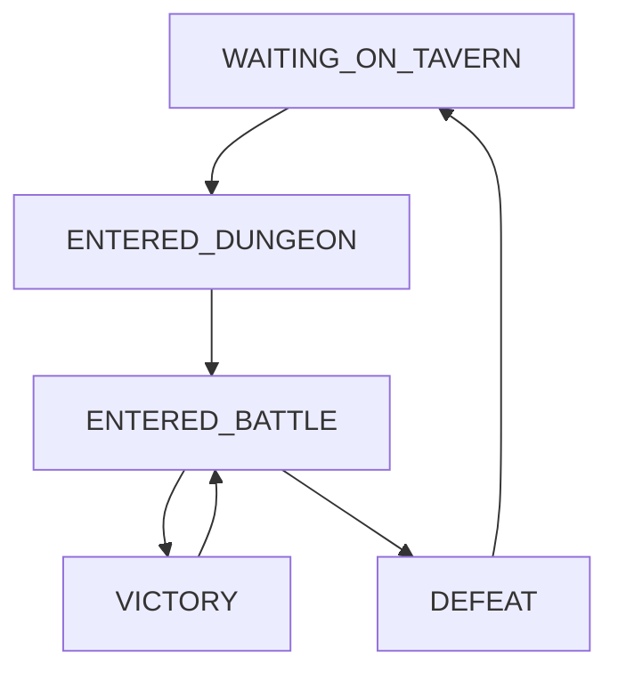
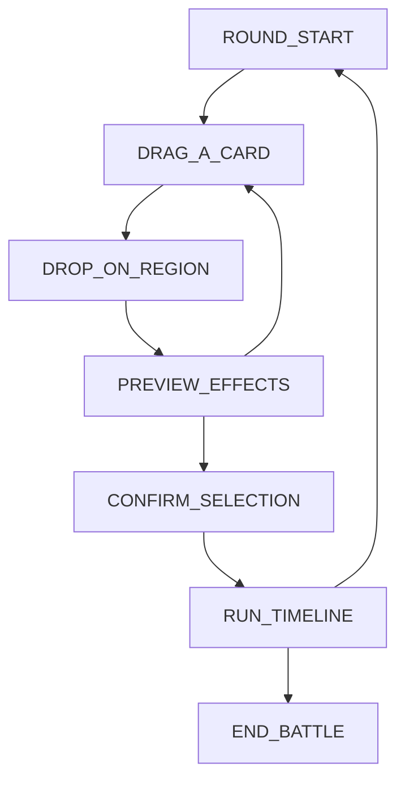

# Game States

## Gameplay States

```mermaid
graph TD;
  WAITING_ON_TAVERN --> ENTERED_DUNGEON
  ENTERED_DUNGEON --> ENTERED_BATTLE
  ENTERED_BATTLE --> VICTORY
  ENTERED_BATTLE --> DEFEAT
  DEFEAT --> WAITING_ON_TAVERN
  VICTORY --> ENTERED_BATTLE
```

## Battle States

```mermaid
graph TD;
  ROUND_START --> DRAG_A_CARD
  DRAG_A_CARD --> DROP_ON_REGION
  DROP_ON_REGION --> PREVIEW_EFFECTS
  PREVIEW_EFFECTS --> CONFIRM_SELECTION
  PREVIEW_EFFECTS --> DRAG_A_CARD
  CONFIRM_SELECTION --> RUN_TIMELINE
  RUN_TIMELINE --> END_BATTLE
  RUN_TIMELINE --> ROUND_START
```
